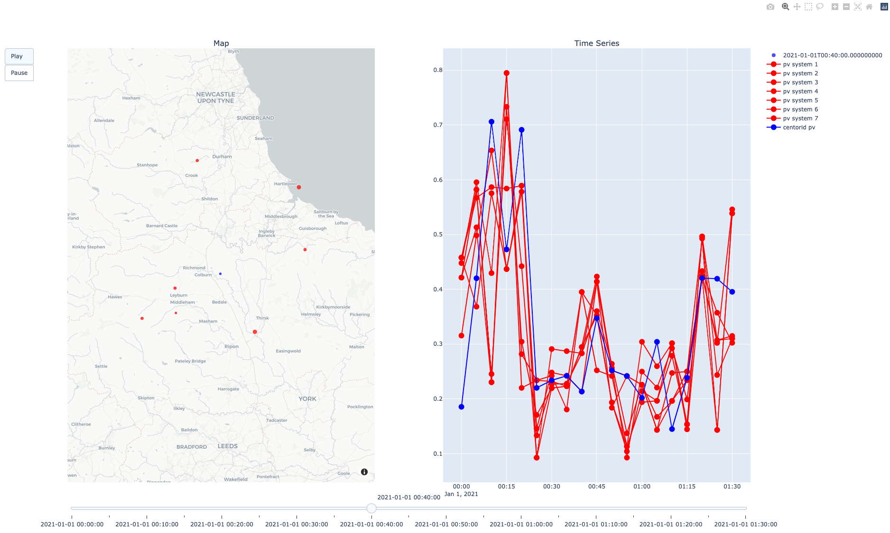
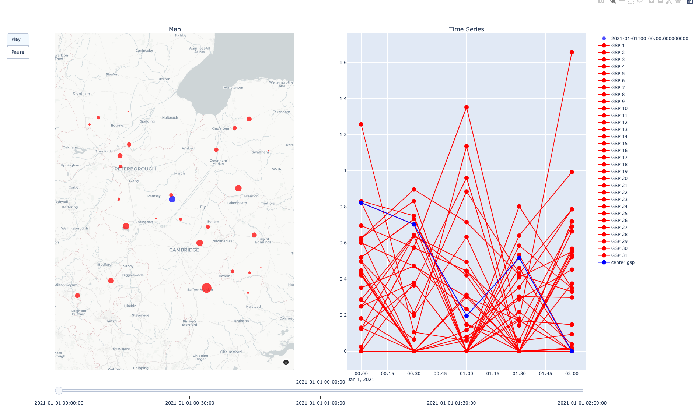
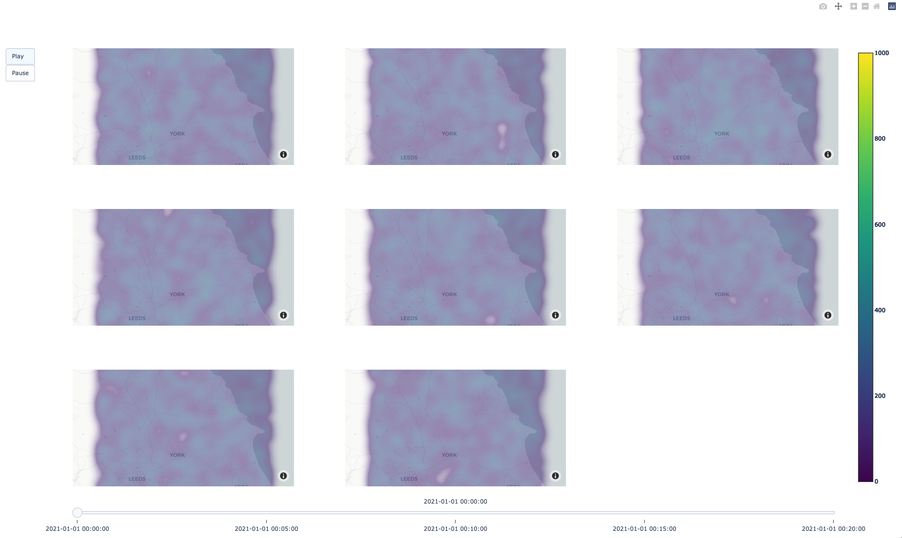
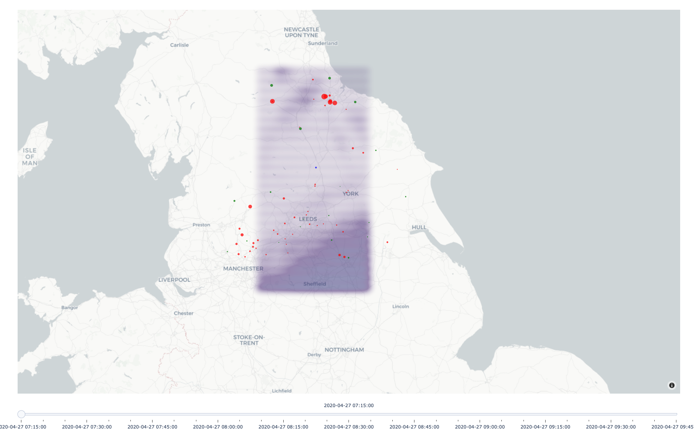

## Plot

# PV

The main pv plot view gives a view of the pv sources in two subplots
1. Video of map of pv intensity over time
2. Plot of time series data of each pv system

# GSP

The main pv plot view gives a view of the pv sources in two subplots
1. Video of map of gsp intensity over time
2. Plot of time series data of each gsp

# TODO update to use gsp shape files

# Satellite

The main satellite plot show a video for each satellite channel over.

# All

Makes an animation of the satellite, PV and GSP systems

